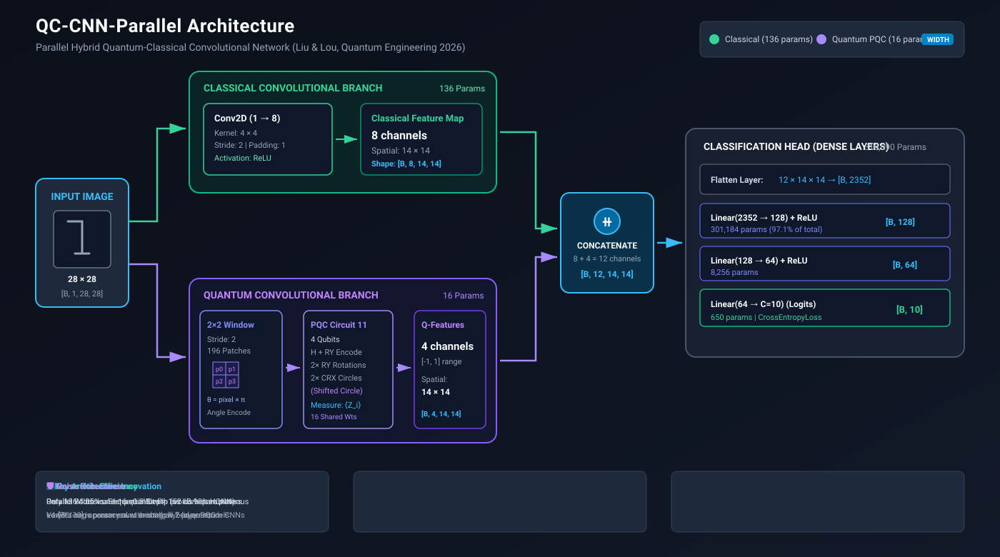
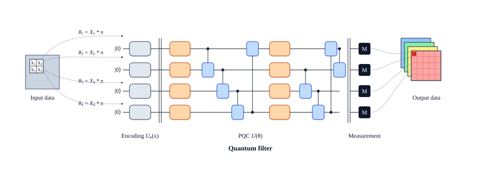

# QC-CNN-Parallel: Parallel Hybrid Quantum-Classical CNN for Image Classification

> **Paper:** *A Parallel Hybrid Quantum-Classical Convolutional Design Using Parameterized Quantum Circuits for Image Classification*
> **Journal:** Quantum Engineering (2026), Article 6643049

[](https://www.python.org/)
[](https://pennylane.ai/)
[](https://pytorch.org/)
[](LICENSE)

---

## 📖 Overview

**QC-CNN-Parallel** is a hybrid quantum-classical convolutional neural network for grayscale image classification. It processes the same input image through **two parallel feature-extraction branches** simultaneously:

1. **Classical Branch** — A standard `Conv2d` (4×4 kernel, stride 2, 8 output channels)
2. **Quantum Branch** — A 4-qubit Parameterized Quantum Circuit (PQC) using a 2×2 sliding window with stride 2

The feature maps are **concatenated** channel-wise and passed to a 3-layer fully-connected classification head.

### Key Highlights

- ✅ **Lowest convolutional parameter count** (136 conv. params) among 7 compared models
- ✅ **90.05% accuracy** on MNIST (no-noise baseline)
- ✅ **4.89% improvement** over existing hybrid quantum CNNs on average
- ✅ **6.24% improvement** over classical CNNs on average
- ✅ **Noise-robust** — maintains high accuracy under bit-flip, phase-flip, and depolarizing channels

---

## 🏗️ Architecture



```
Input image [B, 1, 28, 28]
             |
       -------------------
       |                 |
 Classical branch    Quantum branch
 Conv2d(4×4,s=2)     2×2 PQC window
 [B, 8, 14, 14]      [B, 4, 14, 14]
       |                 |
       --------- Concatenate ---------
                 [B, 12, 14, 14]
                         |
                      Flatten
                    [B, 2352]
                         |
                 Linear 2352 → 128 (ReLU)
                         |
                 Linear 128 → 64  (ReLU)
                         |
                 Linear 64 → C logits
```

### Parameter Summary

| Component | Trainable Parameters |
|---|---:|
| Classical Conv2d (4×4, 8 channels) | 136 |
| Quantum PQC (Circuit 11) | 16 |
| FC1: 2352 → 128 | 301,184 |
| FC2: 128 → 64 | 8,256 |
| FC3: 64 → 10 | 650 |
| **Total (10 classes)** | **310,242** |

---

## ⚛️ Quantum Circuit (Circuit 11)



The 4-qubit PQC uses **16 trainable parameters** arranged in two variational blocks:

```
State prep (per qubit):   H → RY(π·pixel)
Variational Layer 1:      RY(θ₀..θ₃) → CRX circle (q0→q1→q2→q3→q0)
Variational Layer 2:      RY(θ₄..θ₇) → CRX shifted circle (q1→q2→q3→q0→q1)
Measurement:              ⟨Z₀⟩, ⟨Z₁⟩, ⟨Z₂⟩, ⟨Z₃⟩
```

Circuit 11 was selected via a **3-metric evaluation** (Table 2, paper):

| Metric | Circuit 11 | Why it matters |
|---|---:|---|
| Expressibility (↓ better) | 0.0071 | Near-Haar-random state coverage |
| Entanglement | 0.5463 | Balanced qubit correlations |
| Discreteness (new metric) | 0.0191 | Avoids barren plateaus |

---

## 📊 Results

### Classification Accuracy (No-Noise Baseline)

| Model | Conv. Params | MNIST Acc. |
|---|---:|---:|
| Classical CNN (LeNet-5) | 464 | 0.8935 |
| QC-CNN (Henderson et al.) | 448 | — |
| HQNN-Quanv (Senokosov et al.) | 448 | 0.8320 |
| VCNN (Huang et al.) | 456 | — |
| QC-ResNet (Shi et al.) | 512 | — |
| QC-Inception (Wang et al.) | 304 | — |
| **QC-CNN-Parallel (Proposed)** | **136** | **0.9005** |

### Noise Robustness (MNIST, Proposed vs. Baselines)

#### Bit-Flip Noise (Table 6)
| Model | No noise | Error 0.1 | Error 0.2 | Error 0.3 |
|---|---:|---:|---:|---:|
| **Proposed** | **0.9005** | **0.8769** | **0.8558** | **0.8405** |
| HQNN-Quanv | 0.8320 | 0.6775 | 0.6523 | 0.6399 |
| QNN | 0.8350 | 0.7115 | 0.6124 | 0.4615 |

#### Depolarizing Noise (Table 8)
| Model | No noise | Error 0.1 | Error 0.2 | Error 0.3 |
|---|---:|---:|---:|---:|
| **Proposed** | **0.9005** | **0.8639** | **0.8664** | **0.8327** |
| HQNN-Quanv | 0.8320 | 0.7021 | 0.6502 | 0.6059 |
| QNN | 0.8350 | 0.7552 | 0.6944 | 0.5904 |

---

## 📁 Repository Structure

```
QC-CNN-Parallel1/
├── README.md                            # Main project overview & quickstart
├── LICENSE                              # MIT License
├── .gitignore                           # Git ignore rules
├── cur_arc.md                           # Current architecture & experiments specification
├── cur_imple.md                         # Complete implementation analysis & report
├── qc-cnn-parallel.py                   # Standalone smoke test script
│
├── docs/                                # Centralized technical documentation
│   ├── ARCHITECTURE.md                  # Baseline theoretical architecture specification
│   ├── cur_arc.md                       # Current architecture & experiments specification
│   ├── cur_imple.md                     # Mirror of complete implementation analysis
│   ├── EXPERIMENT_SETUP.md              # Experimental configurations & hyperparams
│   ├── DATASETS.md                      # Dataset preparation and split procedures
│   ├── RESULTS.md                       # Complete paper benchmark tables & reproduction
│   ├── IMPROVEMENT.md                   # Scalability & future research directions
│   ├── CHAT_SUMMARY.md                  # Development history and conversation log
│   └── paper/                           # Paper assets
│       ├── Quantum Engineering .pdf     # Original research paper (Liu & Lou, 2026)
│       └── pdf_text.txt                 # Extracted paper text for search
│
├── figures/                             # Visual assets, architectures, and benchmark plots
│   ├── README.md                        # Figures catalog and descriptions
│   ├── qc_cnn_parallel_architecture.svg # High-res vector architecture flow
│   ├── qc_cnn_parallel_architecture.jpg # 16:9 render of dual-branch pipeline
│   ├── pqc_circuit11_schematic.svg      # Vector schematic of Circuit 11
│   ├── pqc_circuit11_diagram.jpg        # 16:9 render of quantum circuit
│   ├── shallow_vs_deep_philosophy.svg   # Vector comparison: width vs. depth
│   ├── shallow_parallel_vs_deep_design.jpg # Render: barren plateau resolution
│   ├── noise_robustness_analysis.svg    # Vector 4-panel noise robustness chart
│   ├── noise_robustness_comparison.jpg  # Render: noise robustness curves
│   └── model_comparison_barchart.svg    # Vector comparison of model parameters & acc
│
├── notebooks/                           # Interactive Jupyter notebooks
│   ├── QC_CNN_Parallel_Experiments.ipynb # Main experiment reproduction notebook
│   └── qc_cnn_kaggle_notebook.ipynb     # Kaggle GPU execution notebook
│
├── scripts/                             # Cluster execution & utility scripts
│   ├── monitor_server.py                # Real-time HTTP dashboard for notebook runs
│   ├── fix_token.py                     # GitHub token configuration utility
│   ├── run_experiment.pbs               # PBS cluster batch submission script
│   └── submit_all.sh                    # Multi-experiment shell runner
│
└── implementation/                      # Core Python package & experiment suite
    ├── __init__.py
    ├── requirements.txt                 # Python dependencies
    ├── run_all.py                       # CLI entry point to run all 5 experiments
    ├── models/                          # PyTorch nn.Module & PennyLane QNodes
    │   ├── qc_cnn_parallel.py           # Main QC-CNN-Parallel model
    │   ├── quantum_circuit.py           # Circuit 11 definition & QNode
    │   ├── scalable_quantum_circuit.py  # N-qubit scalable circuit variant
    │   └── ablation_models.py           # Branch ablation models
    ├── datasets/                        # Dataloaders with balanced subsampling
    │   └── dataloader.py                # MNIST, Fashion-MNIST, Overhead-MNIST loaders
    ├── experiments/                     # Five reproducible paper experiments
    │   ├── experiment1_circuit_selection.py  # PQC expressibility & discreteness
    │   ├── experiment2_classification.py     # Main classification benchmark
    │   ├── experiment3_noise_robustness.py   # Mixed-state noise simulations
    │   ├── experiment4_ablation_study.py     # Quantum vs classical branch ablation
    │   └── experiment5_scalability_study.py  # Qubit count & depth scalability
    ├── training/                        # Training loop and checkpointing
    │   └── trainer.py                   # PyTorch training engine
    ├── utils/                           # Evaluation metrics and plotting
    │   ├── circuit_metrics.py           # Expressibility, entanglement, discreteness
    │   └── plotting.py                  # Training curve & confusion matrix plots
    ├── data/                            # Downloaded dataset cache
    └── results/                         # Output weights, figures, and CSV logs
```

---

## 🚀 Getting Started

### Prerequisites

- Python 3.10+
- CUDA-capable GPU (optional but recommended)

### Installation

```bash
git clone https://github.com/YOUR_USERNAME/QC-CNN-Parallel.git
cd QC-CNN-Parallel/implementation
pip install -r requirements.txt
```

**Tested versions:**
```
pennylane==0.42.3
torch==2.11.0
torchvision==0.26.0
numpy==2.2.6
scikit-learn==1.7.2
matplotlib==3.10.8
```

### Quick Smoke Test

```bash
# From the root directory
python qc-cnn-parallel.py
```

This verifies the model builds correctly and runs a single forward+backward pass on a dummy batch `[4, 1, 28, 28]`.

### Running Full Experiments

```bash
cd implementation

# Run all 3 experiments sequentially
python run_all.py

# Or run individually:
python experiments/experiment1_circuit_selection.py   # Circuit expressibility study
python experiments/experiment2_classification.py      # Main classification (MNIST, Fashion-MNIST, Overhead-MNIST)
python experiments/experiment3_noise_robustness.py    # Noise robustness (bit-flip, phase-flip, depolarizing)
```

---

## 🗂️ Datasets

| Dataset | Classes | Image Size | Training | Test |
|---|---:|---:|---:|---:|
| MNIST | 10 | 28×28×1 | 10,000 (1,000/class) | 2,000 (200/class) |
| Fashion-MNIST | 10 | 28×28×1 | 10,000 (1,000/class) | 2,000 (200/class) |
| Overhead-MNIST | ~11 | 28×28×1 | 8,519 (full) | 1,065 (full) |

Datasets are automatically downloaded via `torchvision` on first run.

---

## ⚙️ Training Configuration

| Hyperparameter | Value |
|---|---|
| Optimizer | Adam |
| Learning rate | 0.01 |
| Loss | Cross-Entropy |
| Batch size (classification) | 32 |
| Batch size (noise experiments) | 100 |
| Epochs | 50 |
| Random seed | 42 |
| Quantum backend | `default.qubit` (analytic) |
| Noise backend | `default.mixed` |
| Gradient method | Parameter-shift rule (PennyLane) |

---

## 📐 Mathematical Foundation

The full mathematical derivation is in [`METHODOLOGY.md`](METHODOLOGY.md). Key equations:

**Quantum feature map** (per 2×2 patch at position (i,j)):
$$F_{\text{quant}}^{(k)}(i,j) = \langle Z_k \rangle_{U(\mathbf{p}_{i,j};\boldsymbol{\vartheta})|0\rangle^{\otimes 4}}$$

**Complete PQC unitary:**
$$U(\mathbf{p};\boldsymbol{\vartheta}) = U_e^{(2)} U_r^{(2)} U_e^{(1)} U_r^{(1)} U_{\text{enc}}(\pi\mathbf{p})$$

**Parameter-shift gradient rule** (Equation 17):
$$\frac{\partial E(\theta)}{\partial \theta_i} = \frac{1}{2}\left[E\!\left(\theta + \frac{\pi}{2}e_i\right) - E\!\left(\theta - \frac{\pi}{2}e_i\right)\right]$$

---

## 🧪 Experiments

### Experiment 1: Circuit Selection Study
Evaluates 11 PQC architectures across 3 topologies (Linear, Circle, All-to-All) using 5,000 numerical simulations each. Selects Circuit 11 based on expressibility, entanglement, and discreteness metrics.

### Experiment 2: Classification Benchmark
Trains and evaluates the proposed QC-CNN-Parallel model against 6 baselines (CNN, QC-CNN, HQNN-Quanv, VCNN, QC-ResNet, QC-Inception) on 3 datasets.

### Experiment 3: Noise Robustness
Simulates 4 noise channels (data noise, bit-flip, phase-flip, depolarizing) at 3 error rates (0.1, 0.2, 0.3) using PennyLane's `default.mixed` simulator.

### Experiment 4: Ablation Study (Quantum vs Classical Contribution)
Systematic isolation of quantum and classical branches across 4 model variants (Full Hybrid, Classical-Only, Quantum-Only, Classical-Extended) on MNIST and Fashion-MNIST to quantify the exact quantum feature expressivity uplift.

### Experiment 5: Scalability & Barren Plateau Study
Parametric sweeps over qubit counts ($N \in \{2, 4, 6, 8\}$) and circuit depths ($L \in \{1, 2, 3, 4, 5\}$) measuring accuracy scaling, gradient variance decay, and trainability dynamics.

---

## 📚 Documentation

| File | Description |
|---|---|
| [ARCHITECTURE.md](ARCHITECTURE.md) | Layer-by-layer model design, tensor shapes, parameter counts |
| [METHODOLOGY.md](METHODOLOGY.md) | Full mathematical treatment (angle encoding, PQC, gradients) |
| [DATASETS.md](DATASETS.md) | Dataset preparation, class balancing, normalization |
| [EXPERIMENT_SETUP.md](EXPERIMENT_SETUP.md) | Exact experimental configurations for reproducibility |
| [RESULTS.md](RESULTS.md) | Paper-reported results + reproduction tracking template |
| [IMPROVEMENT.md](IMPROVEMENT.md) | Identified improvements and future work |
| [CHAT_SUMMARY.md](CHAT_SUMMARY.md) | Architectural expansion, ablation, and scalability design report |

---

## 🔬 Reproduction Notes

The quantum branch evaluates the PQC in **nested Python loops** over batch and patch locations. This is faithful to the conceptual sliding-window design. For 28×28 images:
- **196 circuit evaluations** per image (14×14 patch grid)
- **784 quantum scalar features** per image

For faster execution, consider vectorized quantum-map implementations while preserving the circuit structure and parameter sharing.

---

## 📄 Citation

If you use this implementation, please cite the original paper:

```bibtex
@article{qccnn_parallel_2026,
  title   = {A Parallel Hybrid Quantum-Classical Convolutional Design Using
             Parameterized Quantum Circuits for Image Classification},
  journal = {Quantum Engineering},
  year    = {2026},
  note    = {Article 6643049}
}
```

---

## 🤝 Contributing

1. Fork the repository
2. Create a feature branch (`git checkout -b feature/improvement`)
3. Commit your changes (`git commit -m 'Add improvement'`)
4. Push to the branch (`git push origin feature/improvement`)
5. Open a Pull Request

---

## 📜 License

This project is licensed under the MIT License — see the [LICENSE](LICENSE) file for details.

---

*Implementation cross-verified against the source paper PDF. All architecture details, hyperparameters, and results match the paper's Sections 3.1–3.5 and Tables 1–8.*
